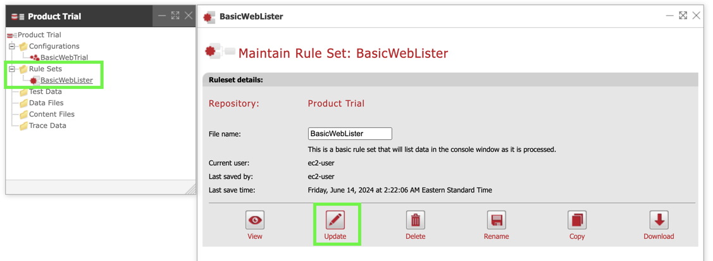
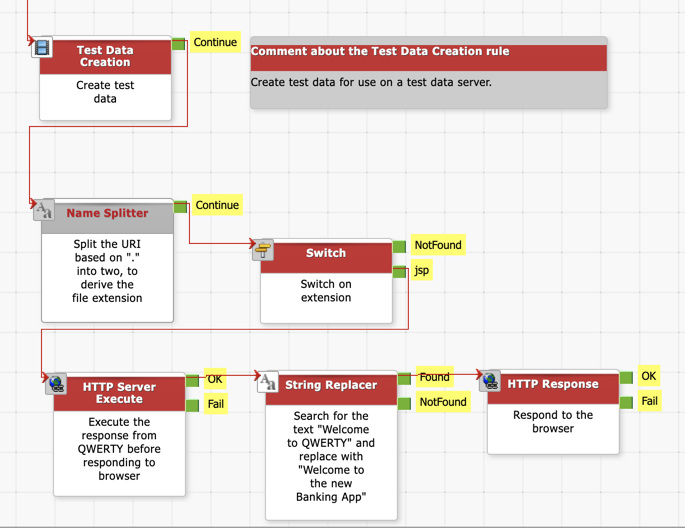
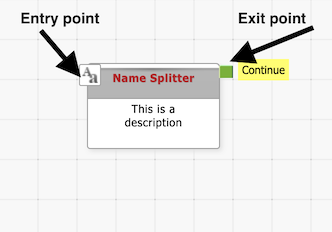
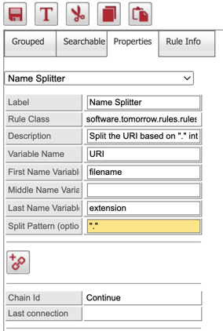
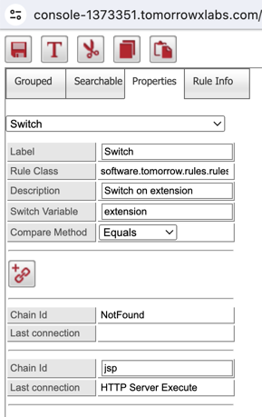
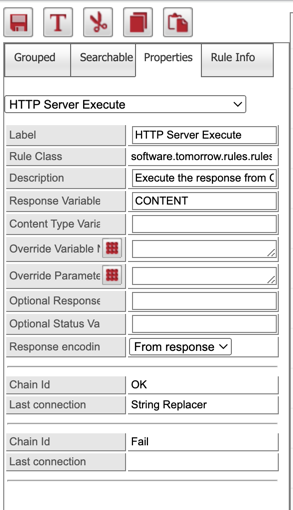
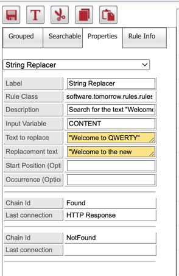
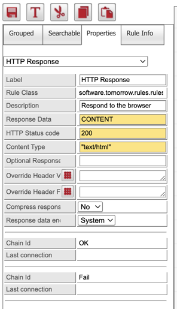
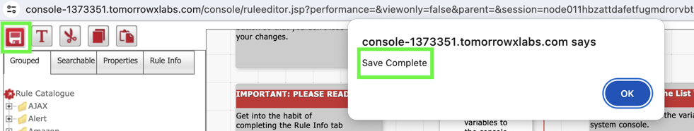
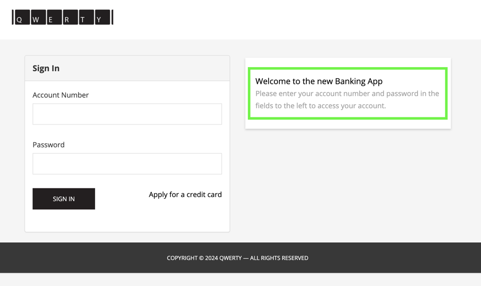

## Exercise 5: Implement Inline Content Change

### Objectives

We are going to use the rules editor to change the title on the QWERTY log in page from "Welcome to QWERTY" to "Welcome the new Banking App" (7)

## Description

We are going to solve this challenge by firstly isolating and looking only at the file types that contain text, including the "Welcome to QWERTY" text, which are jsp pages.  Then we are going to capture the jsp response from the server, execute it on the proxy, search the executed response for the text "Welcome to QWERTY" and then replace it with "Welcome to the new Banking App".  Finally, we will respond to the browser with the updated text. After this exercise, you can go back and change the text to what ever you like.

### Steps

1. **Launch the Rules Editor to compose the solution:**
    - Navigate back to the TomorrowX Console and click on the "Product Trial" repository
    - Click on the "+" next to "Rule Sets" and then click on the Rule Set named "BasicWebLister"
    - This will open up the management screen for that Rule Set.  Click on "Update" to access the Rules Editor screen and catalogue.
  
    

2. **This is what the full composition will look like**
    - Following the below steps, create a composition that looks like the one in the below diagram.

    

3. **Split the filename and to isolate the extension:**

    - Click on "Searchable" at the top left to search the rules catalogue.  You can explore the "grouped" tab to see what other types of rules exist.  When you click a rule, its description will load in the bottom left hand corner.
    - Enter the text "Name Splitter" and the rule that will isolate the extension from the file name will appear.  Drag and drop this rule on to the canvas.  Place it at the bottom of the existing composition as shown in the screenshot.
    - Give the new Rule a description and specify the parameters as shown in the screenshot.
    - Now chain up the new rule to the last one called "Test Data Creation" by clicking on the green exit point of "Test Data Creation", moving your mouse to the the entry point of "Name Splitter" and clicking there.  This will esatablish a visual connection between the two rules.
    - Note: Yellow input parameter fields can accept both variables (without double quotes) and text literals (with double quotes). The text "Welcome to QWERTY" is a text literal and should be enclosed in double quotes when searching. The same applies to the replacement text "Welcome to the new Banking App". If the search or replacement text were stored in a variable, double quotes would not be needed. 

    
    

4. **Switch on the jsp extension:**

    - Now search for and drag the rule called "Switch" onto the canvas. Chain it up so we can use the output of the previous rule as input into the "switch" rule.
    - Set the parameters as shown in the screenshot. Click the add new chainpoint button and set the "Chain Id" to jsp.
    - This rule will switch only on jsp extensions and will ignore everything else via the "Not Found" exit point.

    

5. **Execute the response from QWERTY on the proxy:**

    - Now search for and drag the rule called "HTTP Server Execute" onto the canvas. Chain it up so we can use the output of the previous rule as input into this rule.
    - Set the parameters as shown in the screenshot.
    - This rule will give us the content of the jsp page in the variable we specified so we can process it as required before responding to the browser.

6. **Search and replace the text:**

    - Next search for and add the "String Replacer" rule onto the canvas. Chain it to the "HTTP Server Execute" rule.  
    - We want to search for the text "Welcome to QWERTY" and replacing that text with "Welcome to the new Banking App"
    - Set the parameters as shown in the screenshot.

    
        
7. **Respond to the browser request:**

    - Search, add and chain up the "HTTP Response" rule.
    - Set the parameters as shown in the screenshot to responsd with the modified "CONTENT" variable, a HTTP Status code of "200" and a Content Type of "text/html".

    

8. **Save changes and close window:**

    - With our composition work now complete, its time to save our work and close the Rules Editor screen.
    - Locate the "Save" button in the top left or press control-s or command-s on Mac.
    - After the save is confirmed close the screen and return to the main Console screen.

    

9. **Deploy changes to Capagents:**
    - Deploy the changes to both capagents by clicking on the Deploy button in the BasicWebTrial configuration, in the Configuration folder, in the "Product Trial" repository.
        - If required, you can refer to the content in exercise three on how to deploy a configuration.

10. **Validate the Content Change:**
    - Access the QWERTY app through your browser using the Customer URL of <inject key="DNSZoneName" enableCopy="true" />
    - Confirm that the content has been modified as expected.

    

  
### Conclusion

Congratulations and well done for completing this lab exercise!

What you've learned is a powerful method to introduce changes to any system quickly and without risk. To summarise:

- We began by accessing the system directly.
- Next, we introduced new proxy environments.
- Then, we rerouted the DNS to the new proxy environment.
- Finally, we manipulated the user experience using this proxy environment.

All of this was accomplished without making any changes to the underlying system or requiring any action from the user.
